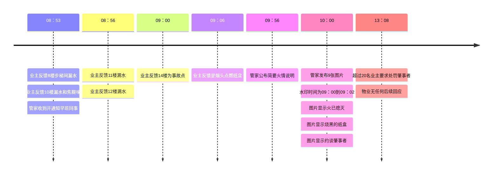

# **2025-06-16 火情外部观察报告 (b-5-e-6-0)**

| 变更时间    | 变更说明      |
| ---------- | ------------ |
| 2025-06-16 | 梳理聊天记录   |
| 2025-06-17 | 整理出评价点   |
| 2025-06-18 | 整理出时间线   |
| 2025-06-19 | 完善评价表    |

- [**2025-06-16 火情外部观察报告 (b-5-e-6-0)**](#2025-06-16-火情外部观察报告-b-5-e-6-0)
- [一、概要](#一概要)
- [二、业主评价](#二业主评价)
- [三、时间线](#三时间线)
- [四、安全事故处置评价表](#四安全事故处置评价表)
- [五、群聊记录](#五群聊记录)
- [六、应急预案 (by Google Gemini 2.5 Pro)](#六应急预案-by-google-gemini-25-pro)
    - [I、 紧急响应与现场处置](#i-紧急响应与现场处置)
    - [II、 明确责任，依法追责](#ii-明确责任依法追责)
    - [III、 善后处理流程](#iii-善后处理流程)
    - [IV、 加强管理，杜绝后患](#iv-加强管理杜绝后患)

# 一、概要

**14楼步梯有人乱扔未熄灭的烟头，点燃了纸盒，引发烟雾报警器，联动了喷淋灭火系统，大量的水从14楼淌到了8楼**

# 二、业主评价
最终得分：53 / 100

| 评价模块   | 满分 | 得分  |
| --------- | -----|----- |
| 应急响应   | 15   | 15   |
| 现场处置   | 30   | 25   |
| 调查分析   | 20   | 10   |
| 善后处理   | 15   | 9   |
| 改进与预防 | 20   | 4   |

# 三、时间线

# 四、安全事故处置评价表
最终得分：53 / 100

<table border="1" style="border-collapse: collapse; width: 100%; font-family: sans-serif;">
<thead style="background-color: #f2f2f2; text-align: center;">
<tr>
<th style="padding: 8px; width: 5%;">序号</th>
<th style="padding: 8px; width: 15%;">评价模块</th>
<th style="padding: 8px; width: 25%;">评价项</th>
<th style="padding: 8px; width: 8%;">满分</th>
<th style="padding: 8px; width: 8%;">得分</th>
<th style="padding: 8px; width: 39%;">量化标准</th>
</tr>
</thead>
<tbody>
<tr>
<td rowspan="2" style="text-align: center; vertical-align: middle;">1</td>
<td rowspan="2" style="padding: 8px; vertical-align: middle;"><b>应急响应 (15分)</b></td>
<td style="padding: 8px;">接报响应及时性</td>
<td style="text-align: center; vertical-align: middle;">5</td>
<td style="text-align: center; vertical-align: middle;">5</td>
<td style="padding: 8px;"><b>得分:</b> 5分钟内响应(5分)。 <b>扣分:</b> 每超1分钟扣1分，扣完为止。</td>
</tr>
<tr>
<td style="padding: 8px;">人员抵达现场及时性</td>
<td style="text-align: center; vertical-align: middle;">10</td>
<td style="text-align: center; vertical-align: middle;">10</td>
<td style="padding: 8px;"><b>得分:</b> 规定时间(如5分钟)内首批人员到达(10分)。 <b>扣分:</b> 每超1分钟扣2分，扣完为止。</td>
</tr>
<tr>
<td rowspan="4" style="text-align: center; vertical-align: middle;">2</td>
<td rowspan="4" style="padding: 8px; vertical-align: middle;"><b>现场处置 (30分)</b></td>
<td style="padding: 8px;">事故定位与信息核实</td>
<td style="text-align: center; vertical-align: middle;">5</td>
<td style="text-align: center; vertical-align: middle;">5</td>
<td style="padding: 8px;"><b>得分:</b> 定位完全准确，信息无误(5分)。 <b>扣分:</b> 定位有偏差或耗时过长扣2分；信息核实错误扣3分。</td>
</tr>
<tr>
<td style="padding: 8px;">危险控制/排除效率</td>
<td style="text-align: center; vertical-align: middle;">10</td>
<td style="text-align: center; vertical-align: middle;">10</td>
<td style="padding: 8px;"><b>得分:</b> 快速有效控制事态，未扩大(10分)。 <b>扣分:</b> 控制措施不当导致事态扩大扣5-10分；处理耗时超出预期扣3-5分。</td>
</tr>
<tr style="background-color: #FFFFE0;">
<td style="padding: 8px;">处置操作规范与安全</td>
<td style="text-align: center; vertical-align: middle;">10</td>
<td style="text-align: center; vertical-align: middle;">6</td>
<td style="padding: 8px;"><b>得分:</b> 流程规范，人员安全防护到位，无次生事故(10分)。 <b>扣分:</b> 违反操作规程扣5分；未做安全防护扣5分；引发次生事故扣10分。</td>
</tr>
<tr>
<td style="padding: 8px;">指挥协调与资源调配</td>
<td style="text-align: center; vertical-align: middle;">5</td>
<td style="text-align: center; vertical-align: middle;">4</td>
<td style="padding: 8px;"><b>得分:</b> 指挥清晰，分工明确，资源调配及时(5分)。 <b>扣分:</b> 出现指挥混乱或资源不到位的情况，每项扣2-3分。</td>
</tr>
<tr style="background-color: #FFD2D2;">
<td rowspan="3" style="text-align: center; vertical-align: middle;">3</td>
<td rowspan="3" style="padding: 8px; vertical-align: middle;"><b>调查分析 (20分)</b></td>
<td style="padding: 8px;">原因分析与时间线还原</td>
<td style="text-align: center; vertical-align: middle;">10</td>
<td style="text-align: center; vertical-align: middle;">5</td>
<td style="padding: 8px;"><b>得分:</b> 原因分析直达根本，时间线清晰准确(10分)。 <b>扣分:</b> 原因分析肤浅扣5分；时间线缺失或错误扣5分。</td>
</tr>
<tr style="background-color: #FFD2D2;">
<td style="padding: 8px;">定损全面性与准确性</td>
<td style="text-align: center; vertical-align: middle;">5</td>
<td style="text-align: center; vertical-align: middle;">2</td>
<td style="padding: 8px;"><b>得分:</b> 人、机、物、环损失统计全面无遗漏，评估准确(5分)。 <b>扣分:</b> 存在明显漏项扣3分；评估偏差较大扣2分。</td>
</tr>
<tr style="background-color: #FFD2D2;">
<td style="padding: 8px;">责任认定合法合规性</td>
<td style="text-align: center; vertical-align: middle;">5</td>
<td style="text-align: center; vertical-align: middle;">1</td>
<td style="padding: 8px;"><b>得分:</b> 责任方(肇事/监管)认定清晰，依据充分，符合法规(5分)。 <b>扣分:</b> 责任认定不清或与事实不符扣5分。</td>
</tr>
<tr style="background-color: #FFD2D2;">
<td rowspan="2" style="text-align: center; vertical-align: middle;">4</td>
<td rowspan="2" style="padding: 8px; vertical-align: middle;"><b>善后处理 (15分)</b></td>
<td style="padding: 8px;">沟通与安抚有效性</td>
<td style="text-align: center; vertical-align: middle;">10</td>
<td style="text-align: center; vertical-align: middle;">2</td>
<td style="padding: 8px;"><b>得分:</b> 对内/外信息发布及时、口径一致，对受影响方安抚到位(10分)。 <b>扣分:</b> 敷衍、推诿、激化矛盾(每项扣5分)；信息发布不及时/不一致(扣3分)。</td>
</tr>
<tr>
<td style="padding: 8px;">现场清理与恢复</td>
<td style="text-align: center; vertical-align: middle;">5</td>
<td style="text-align: center; vertical-align: middle;">4</td>
<td style="padding: 8px;"><b>得分:</b> 在规定时间内彻底清理现场，恢复秩序(5分)。 <b>扣分:</b> 清理不彻底或恢复延迟，扣2-3分。</td>
</tr>
<tr style="background-color: #FFD2D2;">
<td rowspan="3" style="text-align: center; vertical-align: middle;">5</td>
<td rowspan="3" style="padding: 8px; vertical-align: middle;"><b>改进与预防 (20分)</b></td>
<td style="padding: 8px;">纠正与预防措施制定</td>
<td style="text-align: center; vertical-align: middle;">10</td>
<td style="text-align: center; vertical-align: middle;">2</td>
<td style="padding: 8px;"><b>得分:</b> 措施有针对性、可操作、可验证，能杜绝再发(10分)。 <b>扣分:</b> 措施空泛或治标不治本扣5-8分。</td>
</tr>
<tr style="background-color: #FFD2D2;">
<td style="padding: 8px;">文档记录与报告质量</td>
<td style="text-align: center; vertical-align: middle;">5</td>
<td style="text-align: center; vertical-align: middle;">1</td>
<td style="padding: 8px;"><b>得分:</b> 事故报告和所有过程记录完整、规范，可追溯(5分)。 <b>扣分:</b> 记录缺失扣3分；报告不规范扣2分。</td>
</tr>
<tr style="background-color: #FFD2D2;">
<td style="padding: 8px;">信息公开与经验分享</td>
<td style="text-align: center; vertical-align: middle;">5</td>
<td style="text-align: center; vertical-align: middle;">1</td>
<td style="padding: 8px;"><b>得分:</b> 按规定向相关方公开报告，并组织了内部经验分享(5分)。 <b>扣分:</b> 未公开扣3分；未分享扣2分。</td>
</tr>
<tr style="background-color: #f2f2f2; font-weight: bold;">
<td colspan="3" style="text-align: right; padding: 10px;">总分</td>
<td style="text-align: center; vertical-align: middle;">100</td>
<td style="text-align: center; vertical-align: middle;">53</td>
<td style="text-align: left; vertical-align: middle;">得分</td>
</tr>
</tbody>
</table>

综合分析与改进建议
总得分53分，说明本次事故处置的整体表现刚刚及格，但存在极其严重的短板。

从评分结果来看，贵团队在事故发生初期的**“战术响应”（应急响应、现场控制）层面表现优异，行动迅速，控制得力。然而，一旦进入事故后续的“战略管理”**（调查、沟通、总结、预防）层面，则暴露出系统性的、致命的缺陷。

(一) 严重警报区 (红色项：得分率 < 50%)

这部分是本次复盘的重中之重，反映了组织能力的核心短板，必须立即采取行动进行系统性整改。

1. 调查分析模块 (总得分 8/20，得分率40%)
问题诊断: 这是最薄弱的环节。原因分析肤浅、定损遗漏、责任认定不清，这三个问题环环相扣，说明团队缺乏系统性的调查方法论和对法规的敬畏。这不仅影响本次事件的公正处理，更无法为未来预防提供正确方向，是典型的“只救火，不防火”。

改进建议:
引入根本原因分析法 (RCA)：强制要求使用“5 Why分析法”或“鱼骨图”等工具进行事故调查，确保分析能够触及管理的根本漏洞，而不是停留在表面原因。
建立标准化调查工具包：制定《事故调查表》、《定损清单模板》、《谈话记录表》等标准化文件。确保调查人员“照单作业”，避免关键信息遗漏。
责任认定流程化：明确规定责任认定必须基于哪些法规和内部制度，并形成书面报告。重大事件的责任认定，建议引入法务或第三方顾问进行审核，确保公正性和合规性。

2. 善后处理模块 - 沟通与安抚 (得分 2/10，得分率20%)
问题诊断: 沟通安抚工作几乎完全失败。这会直接导致受影响方的怨气和不信任，使小事化大，甚至引发舆论危机，让前期所有的辛苦救火成果付之一炬。

改进建议:
建立沟通预案与模板：针对不同级别的事故，预先制定沟通口径和信息发布模板。明确“谁来说、对谁说、说什么、何时说”。
指定唯一新闻发言人：指定一名训练有素的管理者作为事故的唯一对外信息出口，避免信息混乱和口径不一。
主动、真诚、持续沟通：变被动回答为主动通报。第一时间（如事发后1小时内）发布初步信息，后续定期更新进展。姿态上必须表现出真诚和负责，即使原因仍在调查，也要先安抚情绪。

3. 改进与预防模块 (总得分 4/20，得分率20%)
问题诊断: 这是典型的“好了伤疤忘了疼”。没有制定有效的预防措施、没有规范的文档记录、没有组织经验分享，意味着这次事故的代价被完全浪费了，下一次同类事故几乎必然会再次发生。

改进建议:
建立纠正预防措施(CAPA)跟踪系统：任何事故的调查报告必须附带一个《纠正与预防措施行动计划表》，明确具体措施、责任人、完成时限。并由专人或部门（如安委会）进行关闭验证和跟踪。
推行“一事一档”：强制要求每次事故后形成完整的档案，包括所有原始记录、调查报告、会议纪要、预防措施等，并进行电子化归档。
常态化“事故复盘会”：规定事故处理结束后一周内，必须由负责人组织召开跨部门的复盘会。会议的目的不是追责，而是分享经验教训，并将会议纪要公开发布。

(二) 重点关注区 (黄色项：得分率 50% ~ 80%)

这部分是“做得不够好”的环节，虽未完全失败，但存在明显隐患。

处置操作规范与安全 (得分 6/10):
问题诊断: 现场人员可能因情况紧急而忽略了部分操作规范或安全防护，这在混乱中极易导致救援人员自己成为受害者，或引发次生灾害。

改进建议:
加强情景化演练：日常演练不应只跑流程，要模拟各种突发状况（如设备失灵、人员受伤），强制要求在压力下也能规范操作。
推广“安全观察员”制度：在处置现场，指定一名经验丰富的人员不参与具体操作，专门负责监督现场的安全规范执行情况，并有权随时叫停不安全行为。

(三) 表现优异区

应急响应与现场控制:
肯定: 必须承认，团队在事故发生第一时间的反应速度和控制能力是过硬的，这说明日常的应急预案和一线人员的基本功是扎实的。
保持与固化: 这是团队的优势，需要继续保持并作为培训新员工的标杆。

总结性建议

贵团队是一家“出色的消防队，不合格的管理师”。

短期（1-3个月）：立即针对红色区域的问题，成立专项改进小组，制定详细的整改计划，责任到人，限期完成上述改进建议中的标准化工具和流程。

中期（3-6个月）：全面开展针对中层管理人员和一线主管的系统性培训，重点是根本原因分析、有效沟通和闭环管理。

长期（1年）：将安全管理和事故预防能力，纳入到相关部门和人员的绩效考核(KPI)中，形成“人人重预防、事事有闭环”的安全文化。

# 五、群聊记录
<video controls height="800" src="video/f0f575e790bb47a9a753c20fa7d32b01.mp4"></video>

# 六、应急预案 (by Google Gemini 2.5 Pro)
### I、 紧急响应与现场处置
在火灾被喷淋系统扑灭后，物业公司的首要任务是立即启动应急预案，确保现场安全并防止次生灾害的发生。
确认火情与人员安全： 第一时间派员赶赴现场，确认明火已完全熄灭，并逐户排查是否有人员伤亡或被困，如有伤亡应立即拨打“120”急救电话并协助救援。 
拉起警戒线，保护现场： 在火灾楼层及受影响区域拉起警戒线，禁止无关人员进入，一方面保护火灾现场以备消防部门调查，另一方面防止因地面湿滑、物品掉落等造成二次事故。 
切断电源与水源： 立即关闭受影响区域的公共电源和喷淋系统水源，防止漏电和更大范围的水浸。在专业人员评估前，不要擅自恢复。 
初步情况上报： 立即向当地消防部门、公安派出所及街道办事处（或乡镇政府）报告事故基本情况，包括事发时间、地点、火灾原因初判、有无人员伤亡及财产损失概况等。 
### II、 明确责任，依法追责
根据**《中华人民共和国消防法》及《高层民用建筑消防安全管理规定》**，此次事件的责任划分较为清晰。
肇事业主的主要责任： 在楼道内吸烟并随意丢弃烟头，是引发火灾的直接原因。同时，在楼道内堆放纸盒等易燃物品，严重违反了消防法规中关于禁止占用、堵塞疏散通道的规定。因此，该业主对火灾及其造成的一切直接和间接损失（包括但不限于消防设施损坏、楼下住户的水浸损失、公共区域的修复费用等）承担主要民事赔偿责任。情节严重，造成重大损失的，还可能面临行政处罚甚至刑事责任。 
物业公司的管理责任： 物业服务企业对管理区域内的消防安全负有重要责任。在此次事件中，物业公司需自查是否存在以下管理疏漏： 是否尽到了对楼道堆积物的日常巡查和制止义务？有无相关的巡查记录和对违规业主的劝阻、警告通知？ 
消防安全宣传教育是否到位？有无在楼内显著位置张贴禁止吸烟、禁止堆放杂物的警示标识？ 
消防设施（包括喷淋系统）是否定期维保并处于正常工作状态？ 
如果物业公司未能履行上述安全保障义务，根据**《中华人民共和国民法典》第一千一百九十八条**的规定，可能需要在其能够预见或者应当预见而未采取措施防止损害发生的范围内承担相应的补充赔偿责任。
### III、 善后处理流程
在明确责任的基础上，物业公司应主导后续的善后处理工作，具体步骤如下：
发布官方通知，安抚业主情绪：
在小区公告栏、业主微信群等渠道发布官方情况说明，通报火灾基本情况、原因、责任认定初步结果以及物业正在采取的措施。 
安抚受影响业主，特别是楼下被水浸的住户，承诺将依法依规、公平公正地处理赔偿事宜，避免矛盾激化。 
公布专项负责人及联系方式，建立有效的沟通渠道。 
配合调查，固定证据：
积极配合消防部门的火灾事故调查，如实提供监控录像、巡查记录、相关人员证言等。 
消防部门出具的**《火灾事故认定书》**将是划分责任和后续索赔的重要法律依据。物业公司应及时获取并向相关方公示。 
对火灾现场、楼道损坏情况、楼下水浸情况等进行拍照、录像，全面固定证据。 
组织损失评估与清理修复：
损失评估： 公共部分： 协调专业机构评估喷淋系统、楼道墙面、照明、线路等公共设施的损坏程度和修复费用。 
业主财产： 引导并协助受水浸影响的业主统计财产损失清单，并建议其保留好相关购物凭证。可引入第三方评估机构对损失进行客观评估，作为索赔依据。 
清理工作： 在确保安全的前提下，组织专业保洁人员清理火场残留物及楼道积水，尽快恢复楼道通行。 
协助受灾业主清理室内积水，提供必要的临时帮助。 
修复工程： 待责任划分和赔偿方案明确后，及时组织施工单位对受损的公共设施进行修复。 
协调赔偿与纠纷解决：
组织三方协商： 物业公司应作为协调方，组织肇事业主、受损业主进行协商。依据《火灾事故认定书》和损失评估报告，商讨赔偿方案。 
动用相关保险： 查询物业公司购买的公众责任险是否覆盖此类事故，如适用，应立即向保险公司报案，并按要求提供索赔资料。 
建议并协助业主查询其个人购买的家庭财产保险是否可以理赔。 
法律途径： 如果协商不成，告知受损业主有权通过司法途径向肇事业主提起民事诉讼，物业公司应根据法院要求提供相关证据。 
### IV、 加强管理，杜绝后患
事件处理完毕后，物业公司必须深刻反思，举一反三，加强消防安全管理。
开展专项整治行动： 在全小区范围内开展一次彻底的楼道堆积物清理行动，并建立长效巡查和监督机制。 
强化消防宣传教育： 通过张贴海报、举办消防知识讲座、组织消防演练等多种形式，提高全体业主，特别是此次事件肇事业主的消防安全意识。 
完善管理制度： 将禁止在楼道吸烟、堆放杂物等明确写入《业主管理规约》，并明确违规处理办法。 
加强技防设施： 在重点区域增加监控摄像头，对消防通道等关键部位加强监控。

