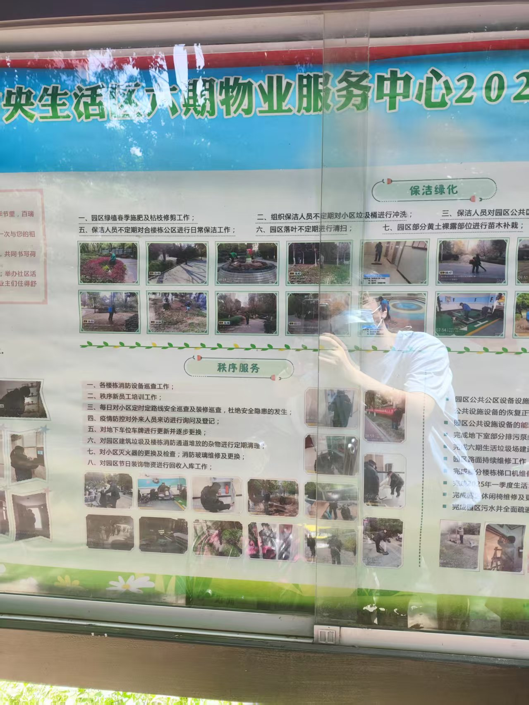

# **业主观察: 百瑞景六期物业服务中心2025年第一季度服务报告**

**变更历史**
| 日期时间     | 类型   | 作者   | 描述                                |
| ----------- | ------ |------- | --------------------------------- |
| 2025-05-25  | 增     | Capric | 拍照                               |
| 2025-06-21  | 增     | Capric | 纂文                               |

- [**业主观察: 百瑞景六期物业服务中心2025年第一季度服务报告**](#业主观察-百瑞景六期物业服务中心2025年第一季度服务报告)
  - [**一、客户工作服务**](#一客户工作服务)
  - [**二、保洁绿化**](#二保洁绿化)
  - [**三、秩序服务**](#三秩序服务)
  - [**四、工程服务**](#四工程服务)
  - [**五、下季度工作重点**](#五下季度工作重点)

## **一、客户工作服务**

接到业主求助773次，贴水卡550户，工程报865次; 完成维修865次。

1. 客服管家日常楼栋装修巡查；
2. 根据实际情况，下发相关通知并公示各个楼栋；
3. 第一季度水费的查抄及公示；          
4. 在园区开展一系列便民服务活动；       
5. 日常业户拜访工作；
6. 每月定期对园区空置房进行巡查；
7. 完成2024年年报公示。

## **二、保洁绿化**
1.  园区绿植春季施肥及枯枝修剪工作； 
2. 组织保洁人员不定期对小区垃圾桶进行冲洗；    
3. 保洁人员对园区公共区域白色垃圾及落叶进行清扫；
4. 保洁人员对园区内的排水沟进行清掏淤泥；
5. 保洁人员不定期对合楼栋公区进行日常保洁工作； 
6. 园区落叶不定期进行清扫；     
7. 园区部分黄土裸露部位进行苗木补栽；         
8. 园区环境消杀工作；
9. 地下车场地面全面清洗工作。

## **三、秩序服务**
1. 各楼栋消防设备巡查工作；
2. 秩序新员工培训工作；
3. 每日对小区定时定路线安全巡查及装修巡查，杜绝安全隐患的发生；
4. 疫情防控对外来人员来访进行询问及登记；
5. 对地下车位车牌更新并逐步更换；
6. 对园区建筑垃圾及楼栋消防通道堆放的杂物进行定期清理；
7. 对小区灭火器的更换及检查；消防玻璃维修及更换；
8. 对园区节日装饰物进行回收入库工作。

## **四、工程服务**
1. 园区公共设备设施的维护和维修工作，确保公共设施设备的恢复正常使用；
2. 园区公共设施的能耗进行抄写工作；
3. 完成地下室部分排污泵维修工作；
4. 完成六期生活垃圾场建造并投入使用；
5. 园区路面持续维修工作；
6. 完成部分楼栋梯口机维修工作；
7. 完成2025年第一季度生活水箱清洗工作；       
8. 完成园区休闲椅维修及更换工作；         
9. 完成园区污水井全面疏通工作。

## **五、下季度工作重点**    
 1. 完成地下室部分排污泵维修工作；            
 2. 园区黄土裸露部位全面补种工作；      
 3. 2025年第二季度水费的抄写及公示； 
 4. 开展便民服务活动；
 5. 完成5、6、8、9号负一楼电梯前室扣板维修及更换；
 6. 完成同区部分路而硬化工作；
 7. 完成园区公共区域栏杆刷漆工作；
 8. 园区绿化整改，对部分黄土裸露部位铺设；
 9. 完成各接定方栓玻璃维修及更换工作；10. 完成四区部分重点装饰工作。

