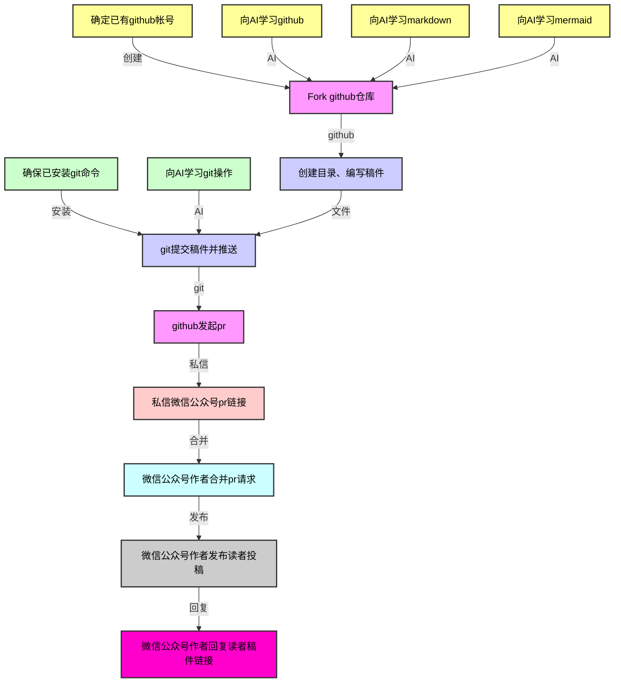

# **如何投稿**

- [**如何投稿**](#如何投稿)
  - [一、工作流](#一工作流)
  - [二、稿件编写入门](#二稿件编写入门)
  - [三、github操作](#三github操作)
  - [四、git操作](#四git操作)
  - [五、微信公众号操作](#五微信公众号操作)

## 一、工作流

## 二、稿件编写入门
1. github学习
   
   你可以问AI助手：`请帮我编写一个github 创建帐号fork/pr 3分钟入门文档`

2. git学习
   
   你可以问AI助手：`请帮我编写一个git 安装/add/commit/push 3分钟入门文档`

3. markdown学习
   
   你可以问AI助手：`请帮我编写一个markdown 10分钟入门文档`

4. mermaid学习
   
   你可以问AI助手：`请帮我编写一个mermaid 10分钟入门文档`

## 三、github操作
1. 确保你已有github帐号，如果没有，可以通过google或者apple帐号登录直接创建

2. 点击打开[社区治理](https://github.com/my-view-points/community-governance)仓库

3. 点击右上角Fork图标

## 四、git操作
1. 确保你已安装git客户端，如果没有，在Windows上可通过winget install git安装，在macOS上可通过brew install git安装，在Linux上可通过你熟悉的包管理器安装

2. 克隆你刚刚Fork后的仓库，加入你的github帐号名为tom12，那仓库地址为https://github.com/tom12/community-governance

3. 进行克隆好的目录，创建目录树year/month/day/index_name (year/month/day为投稿日期，如2025/07/01；index为投稿日期目录下当前已存在目录的最大值加1, index从01开始；name为稿件名英文简称)

4. 创建readme.md，这个为稿件正文，格式为markdown，时序图/流程图等可用mermaid编写，你可以向AI助手学习或者参照已有的稿件

5. 创建image目录，存放图片，在readme.md里面可以通过``来引用，[]里面可输入图片简介，()输入图片相对路径，如你的图片名为abc.jpeg，那可以通过``来引用

6. 创建video目录，存放视频，在readme.md里面可以通过`<video src=""></video>`，src值为视频相对路径，如你的视频名为efg.mp4，那可以通过`<video src="video/efg/mp4"></video>`来引用

7. 通过git add year/month/day/index_name来将投稿内容加入待提交区

8. 通过git commit -m "year/month/day/index_name: add"来将投稿内容提交

9.  通过git push将投稿内容推送到远程仓库

10. 打开你Fork后的创建地址，创建pull request，就可以看到合并请求页面了，复制浏览器地址

## 五、微信公众号操作
1. 给`晒太阳计划`公众号发送私信，内容为刚刚创建pull request页面的链接了，还可以附加上你想说的话

